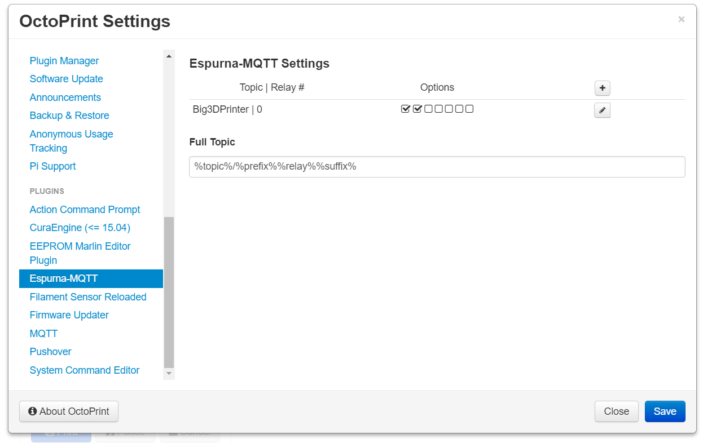
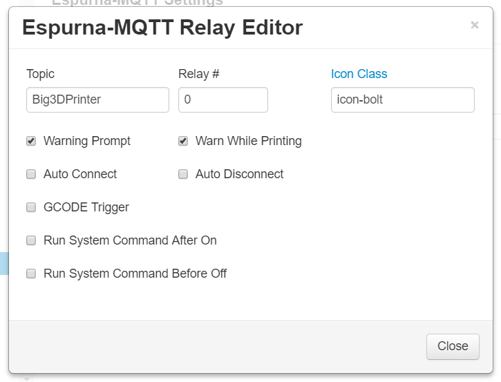

# OctoPrint-EspurnaMQTT

This plugin allows the control of [Espurna](https://github.com/xoseperez/espurna) devices from within OctoPrint via [MQTT](https://github.com/xoseperez/espurna/wiki/MQTT) commands.

## Prerequisites

Install the [MQTT](https://github.com/OctoPrint/OctoPrint-MQTT) plugin via the Plugin Manager or manually using this url:

	https://github.com/OctoPrint/OctoPrint-MQTT/archive/master.zip
	
## Setup

Install via the Plugin Manager or manually using this URL:

    https://github.com/BubbaFatAss/OctoPrint-EspurnaMQTT/archive/master.zip

## Configuration

- Once installed your Espurna devices will allow you to customise the topic.  Specify the full topic in the configuration.  Due to how Espurna generates it's MQTT topics, the full topic should be in the form %topic%/%prefix%%relay%%suffix% - %topic% is substituted with the per-relay topic, whereas %prefix% and %suffix% are used internally and shouldn't be omitted unless you're really sure!  You're unlikely to need to change the full topic, you'll probably just need to set your device name in the per-relay topic and the relay number.
- Use the displayed device's topic in the Espurna-MQTT Plugin settings for the individual relays.
- For multiple relay devices enter the index number that matches your desired relay.  Note:  unlike the original Tasmota-MQTT, for single relay devices like the [iTead Sonoff S20 Smart Socket](https://www.itead.cc/smart-socket.html), you must specify the Relay # as 0.
- Full Topic in plugin settings must match your relay's `Full Topic` pattern.

## Screenshots

## Support My Efforts
This is forked from Tasmota-MQTT plugin by https://github.com/jneilliii/OctoPrint-TasmotaMQTT.  Please consider supporting him if you find this helpful, or dropping me a message if you prefer Espurna over Tasmota ;-).
